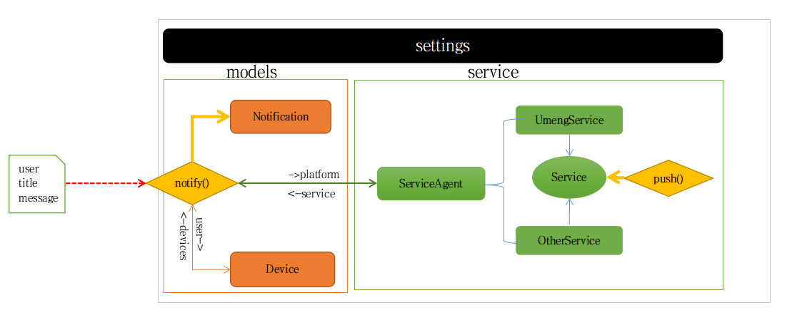

# notification application integrated with other notification services

## 1. Structure Description

## 2. Application Usage

1. Settings

    - common configuration

            USER_MODEL:  which used to bind device, normally is the django auth model

    - Specific Service configuration(UmengService for example):

            UMENG_IOS_KEY = "xxx"
            UMENG_IOS_SECRET = "xxx"
            UMENG_ANDROID_KEY = "xxx"
            UMENG_ANDROID_SECRET = "xxxx"
            UMENG_TEST_MODE = True

2. Services

    When need other some notification service,  we just integrate the service by subclass of BaseService in service.py
    All other notification services is located in package services.

    For example the UmengService in service.py is the a service interface which will use Umeng notification service to
    do actual notification push.

    The ServiceAgent is the only exposed interface, which will return a list of service for the specific platform type, 
    then use all these services instance to do notification push operation. 

3. Models

    In the models, contains 2 models: Device and Notification.  
    Device is the model which used to keep all users' device for notification.
    Notification model has 2 @classmethod notify & notify_device, which used to push message to all user's device, or the
    specified device object.

